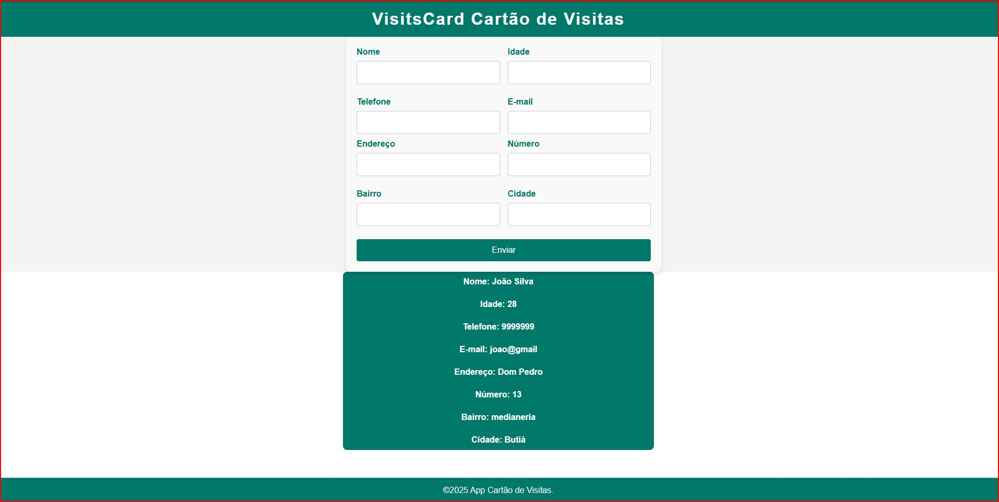

# businessCard 

Este é um projeto de um Cartão de Visitas desenvolvido em **Angular 16**, utilizando **JSON Server** para simular uma API REST.



## 📌 Funcionalidades
- Cadastro de usuários com informações pessoais e endereço.
- Listagem de usuários.


[Demonstração](visitsCard/src/assets/visits1.gif)


## 🛠️ Tecnologias Utilizadas
- **Angular 16** (Framework front-end)
- **TypeScript** (Linguagem utilizada no Angular)
- **JSON Server** (Simulação da API)

---

## 📥 Como baixar e rodar o projeto

### 1️⃣ Clone o repositório


### 2️⃣ Instale as dependências
Certifique-se de que possui o **Node.js** instalado. Depois, execute:
```bash
npm install
```

### 3️⃣ Rode o backend (JSON Server)
O JSON Server já está configurado para rodar automaticamente. Basta iniciar o servidor:
```bash
npm run server
```
O servidor será iniciado em: `http://localhost:5000`

### 4️⃣ Rode o projeto Angular
```bash
ng serve --open
```
O projeto estará disponível em: `http://localhost:4200`

---

## 🔄 Exemplos de Requisições à API (JSON Server)

### Obter todos os usuários:
```http
GET http://localhost:5000/usuarios
```

### Adicionar um novo usuário:
```http
POST http://localhost:5000/usuarios
Content-Type: application/json

{
  "id": "",
  "informacoesPessoais": {
    "nome": "Fulano de Tal",
    "idade": "30",
    "telefone": "(99) 99999-9999",
    "email": "fulano@email.com"
  },
  "endereco": {
    "endereco": "Rua Exemplo",
    "numero": "123",
    "bairro": "Centro",
    "cidade": "São Paulo"
  }
}
```

---

## 🎯 Considerações finais
Este projeto foi desenvolvido para demonstrar a listagem e o cadastro de usuários em Angular, com integração a uma API fake utilizando JSON Server.


👨‍💻 Desenvolvido por **Franciele Alves Franco** 🚀

